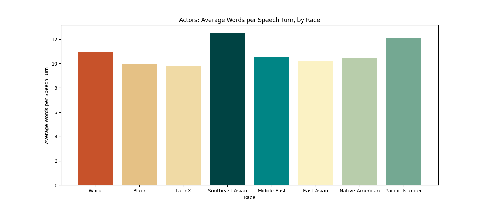
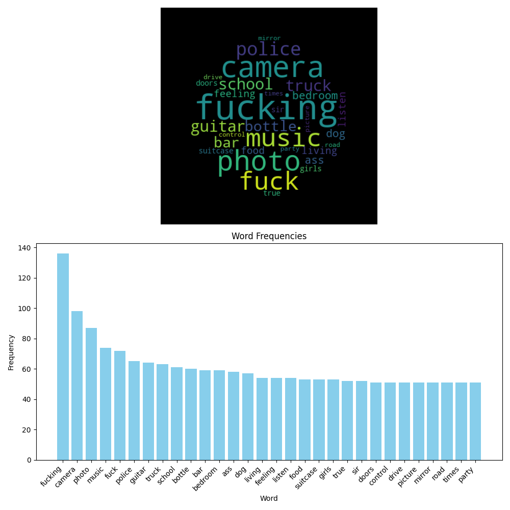

# Culture Analytics of Race depiction in Films
## Introduction
lorem ipsum dolor sit amet, consectetur adipiscing elit. Sed ac purus sit amet nisl justo. Donec nec nulla eget urna tincidunt aliquam. Nulla facilisi bibendum

<br></br>
## Data
looks lik stuff

### Data Collection
did some stuff

### Data Cleaning
did some more stuff

## Word Count Analysis

Used two methods for understanding racial depictions using word counts. The first method was to understand the average number of words actors of different races spoke in the films. The second method was to understand the average length of a line that actors of each race spoke in the films. 

### Average Number of Words Spoken by Actors of Different Races

I first calculated the average number of words spoken by actors of different races based on their dialogs. I did this with the entire dialog and also a cleaned version of the dialog. The cleaned version of the dialog was created by removing all the stop/filler words and punctuation from the dialog. The results are shown in the table below.


### Average Length of a Line Spoken by Actors of Different Races

I then calculated the average length of a line spoken by actors. For example given example, Leopard is counted as having one line and 22 words, while Hopps has one line and 13 words: 

```
LEOPARD
          C'mon! He bared his teeth first.

We land at the front desk and find CLAWHAUSER, a PUDGY
CHEETAH COP, happily eating a bowl of Lucky Chomps cereal.

HOPPS (O.C.)
          Scuse me! Down here? Hi.
          Clawhauser leans over the desk to find Hopps.
```

I did this using the entire dialog from the actor and the number of lines that they spoke in the film, then I aggregated this data for the given race of the actor. The results are shown in the table below.



## Sentiment Analysis

Sentiment Analysis is a technique to understand the emotional tone behind a series of words. Given a sentence, a sentiment of 0.88 would mean that the sentence is very positive (ie: "Have an amazing day!!"), while a sentiment of -0.88 would mean that the sentence is very negative (ie: "Don't ever talk to me again").

To calculate sentiment I used the `VADER` sentiment analysis tool to understand the sentiment of the dialog spoken by actors of different. I processed the entire dialog that actors had per role, and grouped this data by the race of the actors. The results are shown in the graph below.


## Frequency Analysis

What is this?
Frequency analysis is a technique to understand the frequency of words in a text. Given a series of words, we count the occurence of each word and then sort them by frequency. This is useful to understand the most common words spoken by actors of each race.

The dialog that I used was cleaned with named entities removed. The cleaned version of the dialog was created by removing all the stop/filler words and punctuation from the dialog. 

Additionally, I only considered words that appear less than 15% of the time across the entire dataset. This is done to ensure that we don't see words that everyone uses such as "I", "They", "eat", etc.

Then I selected the top 30 words sorted by frequency. For these top 30 words, I created a word cloud to visualize the frequency of words spoken by actors of each race as well as a bar graph to show the frequencies calculated. The results are shown below.
### Black word frequency:


### East Asian word frequency:


### LatinX word frequency:


### Middle East word frequency:


### Native American word frequency:


### Pacific Islander word frequency:


### Asian word frequency:


### White word frequency:


## Named Entity Recognition

What is this?
Named Entity Recognition (NER) is a technique to identify named entities in a text. Named entities are real-world objects such as persons, locations, organizations, etc. For this analysis, I used the `spaCy` library to identify named entities in the dialog spoken by actors of different

